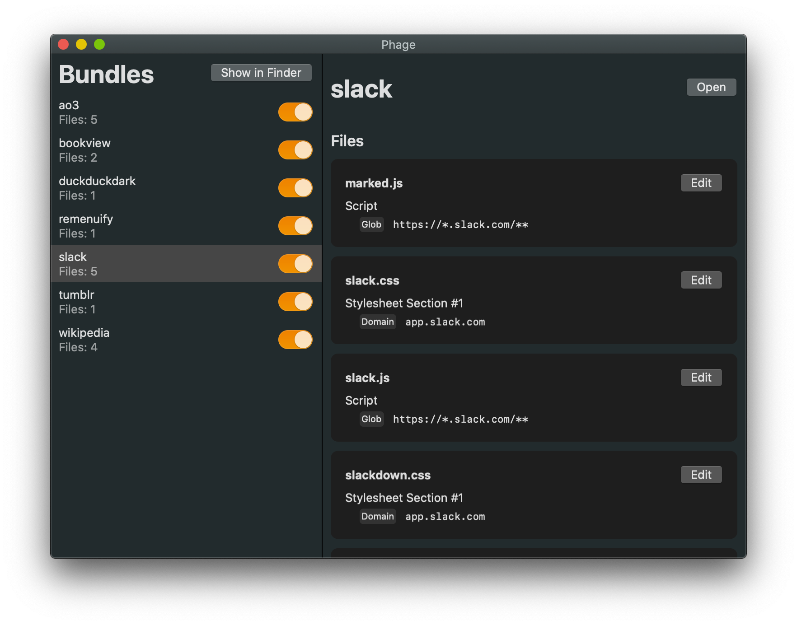

# Phage
A very simple Safari app extension that injects userscripts and userstyles into websites.

Compared to e.g. Greasemonkey <s>there are lots of features missing</s> it’s very lightweight.

## Short Guide
Unlike most other userscript extensions, this extension will load your scripts and styles directly from the file system.
Userscripts and userstyles are simply js and css files organized into bundles.
Bundles are simply folders that are be placed inside the Phage `bundles` folder.
To view this folder, click on “Show in Finder” in the Phage app.

Userscripts should have a [Greasemonkey metadata block](https://wiki.greasespot.net/Metadata_Block).
The following tags are supported:

- `@match <glob>`: for matching URLs
- `@require <absolute url>`: this tag will create a dependency, which can be loaded in the bundle’s detail view from the Phage app. (You can also find all loaded dependencies in the `dependencies` folder in the `bundles` folder’s parent directory)

Currently, there is no Userscript API.

Userstyles should place all style declarations inside a [`@document`](https://developer.mozilla.org/en-US/docs/Web/CSS/@document) declaration (`@-moz-document` will also work).
Any rules outside will be ignored.

## Requirements
- Xcode 11
- macOS 10.15

To build, simply open the project in Xcode, set your signing team in Signing & Capabilities, and run xcodebuild.
